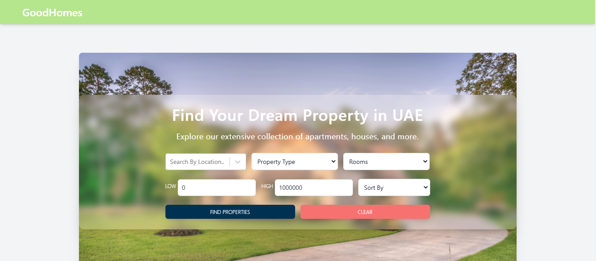
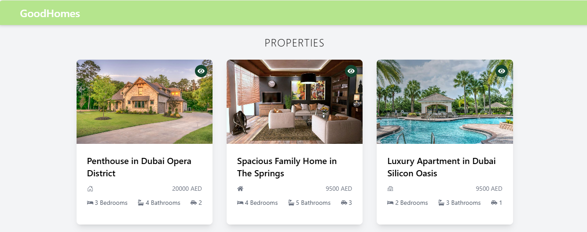
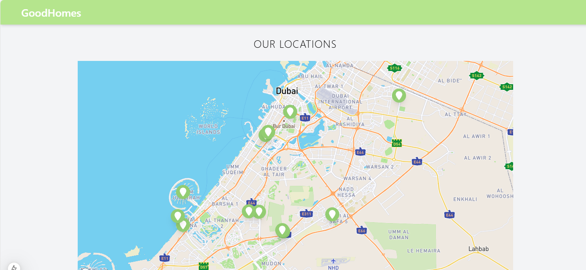

# Nextjs Nestjs Full Stack Property Portal 

### Overview
This project is a comprehensive property portal platform developed using the Nextjs Typescript Nestjs Mongodb Tailwindcss. It includes features such as property management and an admin panel for managing properties.

### Screenshots

#### Home Page


#### Properties


#### Map


### Features

#### Frontend
- **Property Listing**: Browse, search, and filter properties.
- **Property Details**: View detailed information about each property.
- **Responsive Design**: Mobile-friendly layout for an optimal shopping experience on all devices.
- **Scrolling Animation**: Responsive and animated Home page.

#### Backend
- **Property Management**: CRUD operations for managing properties in the database.

#### Admin Panel
- **Property Management**: Add, update, delete, and list products.

### Installation
1. **Clone the repository**
   ```sh
   https://github.com/naf1993/propertyportal.git
   cd propertyportal

2. **Install server dependencies**
    ```sh
    npm install

3. **Install client dependencies**
    ```sh
    cd my-property-portal
    npm install


5. **Create a .env file in the root folder and add the following**
    ```sh
    PORT=5000
    MONGO_URI_LOCAL=mongodb://127.0.0.1:27017/property_portal
    MONGO_URL=your mongodb_uri
    NODE_ENV=development
    CLOUD_NAME=cloudinary name
    API_KEY=cloudinary api key
    API_SECRET=cloudinary api secret

### Usage
1. **Start Backend**
    npm run start:dev
2. **Start Frontend**
    npm run dev


  